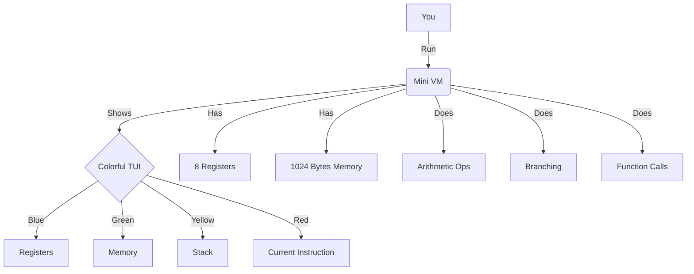

# 🖥️ Mini Virtual Machine

This project implements a mini virtual machine (VM) written in Rust. It's like having a tiny computer that fits in your terminal!



## 🚀 Features

- Basic instruction set including load, store, arithmetic operations, and branching
- 8 general-purpose registers
- 1024 bytes of simulated memory
- Stack support for function calls and local storage
- Colorful TUI displaying registers, memory, stack, and current instruction
- Example program demonstrating VM capabilities

## 🛠️ Prerequisites

- Rust programming language (latest stable version)
- Cargo package manager

## 🏗️ Building and Running

1. Clone the repository:
   ```
   git clone https://github.com/v8v88v8v88/mini-vm.git
   cd mini-vm
   ```
2. Build the project:
   ```
   cargo build --release
   ```
3. Run the VM with the example program:
   ```
   cargo run --release
   ```

## 📚 Instruction Set

The VM supports a variety of instructions, including:

- `Load(reg, value)`: Load a value into a register
- `Store(reg, address)`: Store a value from a register into memory
- `Add(dest, src1, src2)`: Add values from two registers
- `Sub(dest, src1, src2)`: Subtract values from two registers
- `Mul(dest, src1, src2)`: Multiply values from two registers
- `Div(dest, src1, src2)`: Divide values from two registers
- `Jump(address)`: Jump to a specific address
- `JumpIfZero(address)`: Conditional jump if flag is zero
- `JumpIfNegative(address)`: Conditional jump if flag is negative
- `Push(reg)`: Push a value onto the stack
- `Pop(reg)`: Pop a value from the stack
- `Call(address)`: Call a function
- `Return`: Return from a function call
- `Halt`: Stop the VM execution

## 🖊️ Writing Programs for the VM

To write a program, create an array of 32-bit unsigned integers. Each instruction is encoded as:

- Bits 31-28: Opcode
- Bits 27-24: Register 1
- Bits 23-20: Register 2
- Bits 19-16: Register 3
- Bits 15-0: Immediate value or address

Example:
```rust
0x00000005 // Load R0, 5
```

Check `src/vm/instruction.rs` for the complete list of opcodes and their encodings.

## 🤝 Contributing

Contributions are welcome! Feel free to submit a Pull Request.
